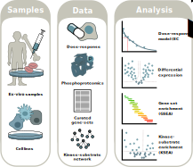

# OncoSignature - Drug response prediction on Acute Myeloid Leukemia

Copyright (C) 2019 Nicolàs Palacio 
Contact: nicolas.palacio@bioquant.uni-heidelberg.de 

GNU-GLPv3:

This program is free software: you can redistribute it and/or modify
it under the terms of the GNU General Public License as published by
the Free Software Foundation.

This program is distributed in the hope that it will be useful, but
WITHOUT ANY WARRANTY; without even the implied warranty of
MERCHANTABILITY or FITNESS FOR A PARTICULAR PURPOSE. See the GNU
General Public License for more details.

A full copy of the GNU General Public License can be found on
http://www.gnu.org/licenses/.

This repository contains the scripts used to analyze and extract
phosphorylation signatures of drug response in AML samples.

